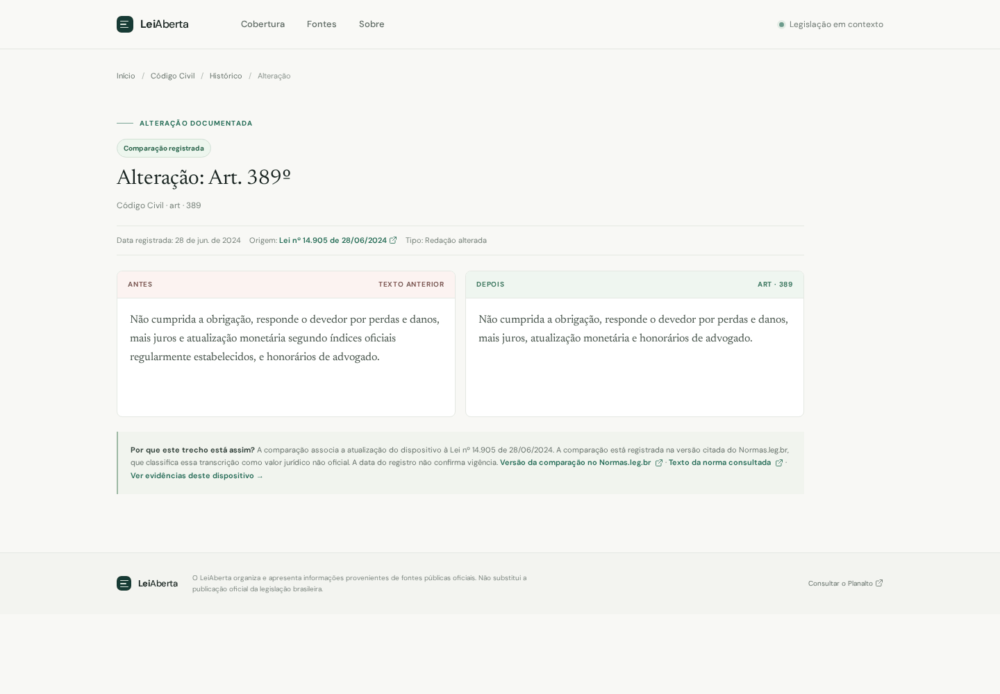
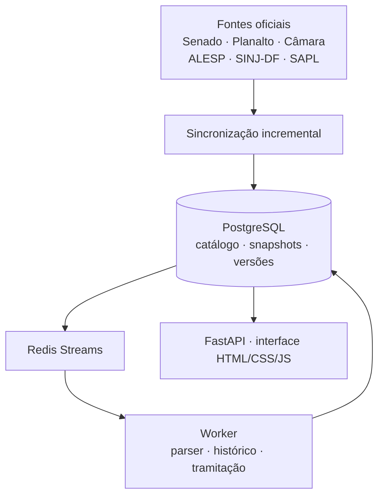

# LeiAberta

**Entenda como uma lei chegou ao texto atual.**

LeiAberta conecta catálogos e documentos legislativos públicos a texto estruturado, alterações verificáveis e fontes oficiais. Catálogo, texto, histórico e tramitação são estágios diferentes; lacunas ficam visíveis.

[Abrir o LeiAberta](https://web-production-12e95.up.railway.app) · [Ver o antes e depois de uma alteração real](https://web-production-12e95.up.railway.app/diff/be3a1531-edaa-5a78-94ca-70c6544e3853) · [API](docs/API.md) · [Contribuir](CONTRIBUTING.md)

Alterações do projeto: [CHANGELOG.md](CHANGELOG.md).

[](https://github.com/DIDIDXX/LeiAberta/actions/workflows/ci.yml) [](LICENSE)



[Assistir à demo de 30 segundos](docs/assets/launch/demo.webm) · [Ver screenshots](docs/assets/launch/)

## Por que existe

A legislação brasileira está distribuída por muitos portais. Encontrar o texto de uma norma é só o primeiro passo; comprovar como um dispositivo mudou exige relacionar versões e documentos oficiais sem confundir uma referência legislativa com uma diferença textual.

O LeiAberta mantém dados observáveis e separa metadados catalogados, texto capturado, estrutura interpretada, relação oficial, diff textual e tramitação. A cobertura não é integral e não é apresentada como tal.

## Demonstração

A home abre o diff registrado do art. 389 do Código Civil: a redação anterior e posterior associadas à Lei 14.905/2024. O registro da comparação vem do Normas.leg.br, que classifica sua transcrição como valor jurídico não oficial; a página mostra essa ressalva e liga separadamente ao texto consolidado consultado. A data associada ao registro não é apresentada como data de vigência. O caso complementar da Lei Maria da Penha demonstra uma inclusão com fonte primária e, por isso, sem texto anterior.

## Recursos

- Busca por nome, número, dispositivo e variações comuns como `LGDP`.
- Leitor com IDs estáveis para artigos e subdivisões.
- Histórico que distingue comparação textual de relação oficial ainda sem texto histórico pareado.
- Explicação e Blame por dispositivo: ato modificador verificado quando disponível, lacuna explícita quando não.
- Páginas públicas de [fontes](/fontes), [cobertura](/cobertura) e [sobre](/sobre).
- Snapshots oficiais, SHA-256, versão do parser e jobs duráveis para hidratação e histórico.

## Arquitetura



## Integridade dos dados

`captura oficial → SHA-256 do documento → versão do parser → dispositivos estruturados → evidência da alteração`.

Uma relação oficial não demonstra por si só o texto anterior e posterior. `retrieved_at` registra a captura, não a vigência. Autoria da proposição, autoria de emenda, relatoria, votação e sanção são papéis diferentes da autoria de cada linha normativa.

## Como novas normas entram

O worker verifica periodicamente os adaptadores disponíveis, respeitando o freshness próprio de cada fonte. O intervalo de verificação tem padrão de uma hora; catálogos Senado e IBGE têm freshness de 24 horas; ALESP, SINJ-DF e SAPL, sete dias. Uma falha não apaga os registros já armazenados e gera nova tentativa limitada. Após enumeração, a norma fica pesquisável; texto e histórico podem continuar pendentes.

Isso cobre apenas fontes com adaptador ativo. Ter uma jurisdição configurada ou aparecer no diretório do IBGE não significa que seu catálogo legislativo esteja integrado.

## Começar localmente

Requer Python 3.12+. SQLite basta para a API local; PostgreSQL e Redis são necessários para exercitar os serviços distribuídos.

```bash
git clone https://github.com/DIDIDXX/LeiAberta.git
cd LeiAberta
python -m venv .venv
source .venv/bin/activate
pip install -r requirements-dev.txt
cp .env.example .env
alembic upgrade head
python -m app.seed
uvicorn app.main:app --reload
```

Abra `http://localhost:8000`. `LOCAL_INLINE_JOBS=1` habilita jobs inline locais. Para rodar worker, configure `DATABASE_URL` e `REDIS_URL` e use `python -m app.worker`.

## API

```bash
curl 'https://web-production-12e95.up.railway.app/api/search?q=LGDP'
curl 'https://web-production-12e95.up.railway.app/api/laws/13709-2018/history'
curl 'https://web-production-12e95.up.railway.app/api/laws/10406-2002/blame?limit=20'
```

Veja [docs/API.md](docs/API.md) para endpoints, paginação, rate limits e semântica de evidência. O OpenAPI está disponível em `/openapi.json`.

## Testes

```bash
pytest -q
npm ci
npm run test:e2e
```

Testes de parser e integração usam fixtures; não dependem de os portais oficiais estarem online. O smoke de produção é separado.

## Fontes e limites

Há adaptadores para catálogos do Senado, IBGE, ALESP, SINJ-DF e instalações SAPL selecionadas. As páginas do site e `GET /api/sources` mostram o estado observado. O acervo não é a totalidade da legislação brasileira, e nem todo metadado tem texto integral disponível. Normas.leg.br pode classificar transcrições como não oficiais; essa classificação é preservada.

## Contribuir

Ajude a mapear a legislação brasileira. Para propor fonte, informe o órgão oficial, jurisdição, URL, termos de uso, paginação, identidade externa, freshness e exemplos pequenos de resposta. Comece por [CONTRIBUTING.md](CONTRIBUTING.md); erros jurídicos podem ser abertos por [issue](https://github.com/DIDIDXX/LeiAberta/issues/new/choose) com dispositivo e link oficial.

## English summary

LeiAberta is an open source project that links Brazilian legal texts to official sources and verified amendments. It distinguishes catalog records, downloaded texts, structured provisions, legislative relations, and textual diffs. Coverage is incomplete and displayed with its gaps. The service uses FastAPI, PostgreSQL, Redis Streams, and a background worker. Contributions that add official sources and reproducible fixtures are welcome.

## License

MIT. See [LICENSE](LICENSE).
